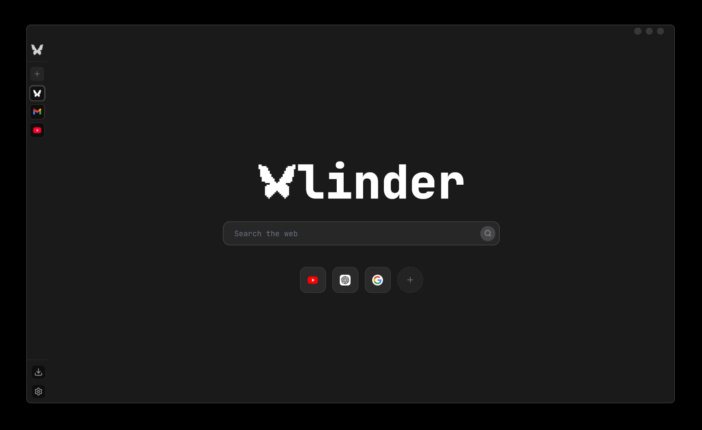
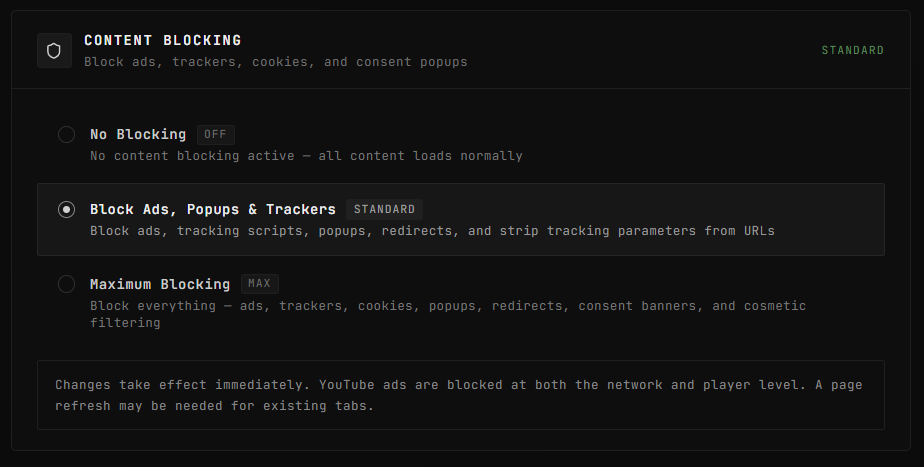
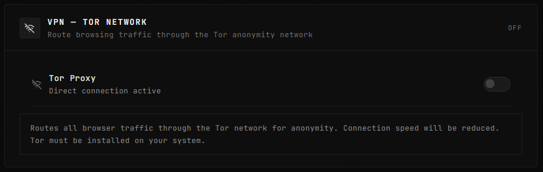
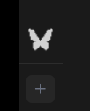
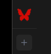

<p align="center">
  
</p>

<h3 align="center">The Best Open-Source Electron Browser for Privacy and Performance</h3>

<p align="center">
  Vlinder is a free, open-source desktop web browser built entirely on <strong>Electron</strong>. It is the most feature-complete Electron-based browser available, shipping with a three-tier ad blocker, Tor network proxy, incognito mode, password manager, split screen, tab groups, and 7 customizable themes -- all built in, no extensions needed. Designed as a lightweight, low-memory alternative to Chrome, Brave, and Firefox for Windows, macOS, and Linux.
</p>

<p align="center">
  
  
  
  
  
  
  
  
</p>

<p align="center">
  <a href="#all-features-including-new-in-v2">Features</a> &bull;
  <a href="#ad-blocker-deep-dive">Ad Blocker</a> &bull;
  <a href="#tor-network-integration">Tor / VPN</a> &bull;
  <a href="#incognito-mode">Incognito</a> &bull;
  <a href="#getting-started">Install</a> &bull;
  <a href="#architecture">Architecture</a>
</p>

---

## What is Vlinder?

**Vlinder** is a free, open-source, privacy-focused desktop web browser for Windows, macOS, and Linux. Built on **Electron** (Chromium-based), it is the most feature-rich Electron browser available today and is designed to be a lightweight, low-memory alternative to Chrome, Edge, Brave, and Firefox that comes with everything you need built in and nothing you don't. If you are searching for an Electron browser, an Electron-based browser, or an open-source browser built with Electron, Vlinder is it.

Most modern browsers require a stack of extensions for basic privacy: an ad blocker, a tracker blocker, a password manager. Vlinder ships all of these as first-class, native features. A three-tier content blocker powered by the Ghostery engine blocks ads, trackers, popups, and YouTube video ads at both the network and player level. A built-in Tor proxy routes all traffic through the Tor anonymity network with one toggle. An incognito mode creates fully ephemeral sessions that leave zero trace on disk. A secure password manager with auto-fill stores credentials in your operating system's keychain. All of this works out of the box with no configuration and no extensions.

Vlinder is also engineered for low memory consumption. Instead of spawning a separate process per tab like Chromium-based browsers, it renders all webviews inside a shared Electron process with intelligent session management. The result is a browser that stays light and fast, even with dozens of tabs open on machines with limited RAM.

Every platform and website shares a unified authentication session by default, so you sign in once and stay signed in everywhere. Google services are fully supported without the "insecure browser" warning that plagues most Electron-based browsers, thanks to clean user-agent handling and correct SEC-CH-UA client hint headers.

<p align="center">
  
</p>

---

## Why Vlinder? (Electron Browser Comparison)

How does Vlinder compare to other browsers, including other Electron-based browsers like Min and Beaker?

| | Vlinder (Electron) | Chrome | Brave | Firefox | Min (Electron) | Beaker (Electron) |
|---|:---:|:---:|:---:|:---:|:---:|:---:|
| Open Source | GPL-3.0 | Partial | MPL-2.0 | MPL-2.0 | Apache-2.0 | MIT |
| Built-in Ad Blocker | 3 tiers | No | Yes | No | 1 tier | No |
| YouTube Ad Blocking | Network + Player | No | Network only | No | No | No |
| Built-in Tor Proxy | Yes | No | Tor window | No | No | No |
| Built-in Password Manager | OS Keychain | Yes (cloud) | Yes (cloud) | Yes (cloud) | No | No |
| Tab Groups | Drag to group | Yes | Yes | No | No | No |
| Split Screen | Native | No | No | No | No | No |
| Incognito Mode | Ephemeral partition | Yes | Yes | Yes | No | No |
| Multi-Window | Yes | Yes | Yes | Yes | Yes | Yes |
| Transparency / Glass UI | Acrylic + Glass theme | No | No | No | No | No |
| Custom Themes | 7 built-in | No | Limited | Limited | No | No |
| Low Memory Footprint | Single process | No (multi-process) | No | No | Yes | No |
| Google Login Support | Full (UA spoofing) | Native | Native | Native | Broken | Broken |
| Customizable Shortcuts | Every shortcut | Limited | Limited | Yes | No | No |
| No Telemetry | Zero | Heavy | Some | Some | Optional | No |
| Extensions Required | None | Many | Some | Many | Some | N/A |

---

## All Features (Including New in v2)

Vlinder v2 is a ground-up rewrite with a completely new UI, new architecture, and dozens of features that were not present in v1. Below is a comprehensive list of everything the browser can do.

### Sidebar & Navigation

- **Collapsible Sidebar** with three modes: Expanded (full labels), Compact (icons only), and Hidden (auto-reveal on hover near the edge).
- **Sidebar Position** configurable to the left or right side of the window.
- **Navigation Buttons** (Back, Forward, Refresh) individually toggleable from settings, displayed directly in the sidebar.
- **Drag-and-Drop Tab Reordering** with smooth animations powered by `@dnd-kit`. Tabs stay in place during drag; drop position indicators appear above or below the target.
- **Tab Pinning** with support for both list-style and square-style pinned tab display.
- **Tab Muting** per platform with a one-click mute toggle.
- **Platform Notification Badges** showing unread counts on each tab icon, with per-platform and global notification controls.
- **Dynamic Favicon Discovery** with automatic extraction from page metadata, Google's favicon service, and DuckDuckGo as a fallback.
- **Custom Platform Installation** via the built-in App Store allowing any URL to be turned into a sidebar app.
- **Temporary Apps** for external links that open as disposable tabs with the option to convert them into permanent sidebar apps.
- **Context Menus** on every tab for reload, mute, pin, close, duplicate, copy link, open in split screen, and tab group management.

### Tab Groups

- **Create Tab Groups** by dragging one tab over another and holding for 0.8 seconds. A visual ring indicator confirms the grouping action.
- **Group Headers** with a colored `Layers` icon, tab count badge, and collapse/expand chevron.
- **Group Colors** with a palette of 8 colors (Gray, Red, Orange, Yellow, Green, Blue, Purple, Pink) selectable from a context menu.
- **Rename Groups** directly from the context menu.
- **Collapse/Expand Groups** to hide grouped tabs and save sidebar space.
- **Unlink Groups** to dissolve a group back into individual tabs without closing anything.
- **Close Entire Groups** in one click.
- **Visual Indicators** in compact mode: grouped tabs display a colored left border to distinguish them from ungrouped tabs.

### Split Screen

- **Side-by-Side Browsing** by right-clicking any non-active tab and selecting "Open in Split Screen."
- **50/50 Split Layout** with a clean 1px divider between panes.
- **Independent Navigation** in each pane, both panes run their own webview and can navigate independently.
- **Close Button** on the split pane to return to single-view mode.

### Incognito Mode

- **Ephemeral Sessions** via `Ctrl+Shift+N` that use a non-persistent Electron session partition. No cookies, cache, local storage, or browsing history survives after the window is closed.
- **Disabled History Recording** so incognito sessions never write to the history database.
- **Red Logo Indicator** on the sidebar butterfly icon. The logo turns red using a CSS filter so you always know which windows are private.
- **Full Feature Parity** with normal windows: all shortcuts, tab groups, split screen, ad blocking, and platform support work identically.

### Multi-Window Support

- **New Window** via `Ctrl+N` opens a fresh browser window with its own independent state.
- **Incognito Window** via `Ctrl+Shift+N` opens a privacy-isolated window.
- **Safe Multi-Window Shortcuts**: all keyboard shortcuts dynamically target the currently focused window. No stale references, no crashes when windows are closed.
- **Independent Window State**: each window maintains its own tab set, sidebar mode, and active platform.

### Themes & Customization

- **7 Built-In Themes**: Graphite (default), Crimson, Rose, Ocean, Forest, Amethyst, and Glass.
- **Full CSS Variable Theming**: each theme defines 30+ CSS variables controlling every surface, border, text shade, and gradient in the UI.
- **Glass Theme** with transparent backgrounds designed to pair with the transparency mode for a frosted-glass look.
- **Acrylic/Transparency Mode** (Windows) that makes the entire browser window translucent, showing the desktop wallpaper behind the UI. Toggle it in Appearance settings.
- **Original or Monochrome Logos** for sidebar platform icons, switchable from settings.
- **Loading Progress Bar** toggleable at the top of the content area.
- **Square or List Pinned Tabs** to match your preferred layout density.

### Command Palette & Address Bar

- **Command Palette** (`Ctrl+T`) with a search bar that doubles as a URL bar, showing search suggestions, history, and tab-switching results.
- **Address Bar** at the bottom of the page displaying the current URL with a copy button, toggleable from Appearance settings.
- **Smart URL Detection** that auto-prefixes `https://` for bare domains.
- **Zero-Suggest** showing recent history and frequently visited sites when the palette is opened with an empty query.

### Ad Blocker & Content Blocking

- **Three-Tier Blocking** system with No Blocking, Standard (ads + trackers + popups), and Maximum (everything + cookies + consent banners + cosmetic filtering).
- **Powered by Ghostery's `@ghostery/adblocker-electron`** engine using industry-standard filter lists (EasyList, EasyPrivacy, Fanboy's Annoyances, Peter Lowe's).
- **YouTube Ad Blocking** at both the network request level (blocking ad server domains) and the player level (a MutationObserver-based script that auto-skips ads, removes overlay banners, and hides promoted content).
- **Tracking Parameter Stripping** that removes `utm_*`, `fbclid`, `gclid`, `msclkid`, and 20+ other tracking parameters from URLs on navigation.
- **Cookie Consent Banner Blocking** that filters requests to CookieBot, OneTrust, TrustArc, Quantcast, and other consent management platforms.
- **Popup Bombing Protection** with a rate limiter that caps `window.open()` calls to 1 per 2 seconds per webview, preventing popup storms on sketchy sites.
- **Ad Redirect Detection** that blocks navigation to known ad/redirect domains, suspicious TLDs (`.cfd`, `.buzz`, `.top`, `.xyz`, etc.), and URLs matching ad URL patterns.
- **Changes Apply Immediately** without restarting the browser. A page refresh may be needed for existing tabs.

### Tor Network Integration (VPN)

- **Built-In Tor Proxy** toggle in Privacy settings that routes all browser traffic through the Tor anonymity network.
- **SOCKS5 Proxy** configuration applied at the Electron session level, so all webviews inherit the Tor route.
- **New Identity** button that requests a fresh Tor circuit for a new exit node IP, displayed directly in settings.
- **Connection Status** indicator showing Off, Connecting (with circuit bootstrap progress), or Active with the exit node IP address.
- **No External Software Required** for basic operation (Tor must be installed on the system, but the browser handles proxy configuration automatically).

### Password Manager

- **Automatic Password Capture** that detects login form submissions and prompts to save credentials with a non-intrusive notification.
- **Auto-Fill** that populates username and password fields on page load when saved credentials exist for the current domain.
- **Credential Viewer** in Settings > Passwords showing all saved credentials organized by domain with search functionality.
- **Secure Storage** using the system keychain (`keytar`) for encrypted credential storage. Credentials are never stored in plaintext.
- **Update Detection** that recognizes when you change a password for an existing account and offers to update the saved credential.
- **Never Save** option per-domain to permanently skip the save prompt for sites where you don't want credentials stored.

### Download Manager

- **Built-In Download Manager** accessible via `Ctrl+J` or the sidebar Downloads icon.
- **Real-Time Progress Tracking** with download speed, estimated time remaining, and percentage completion.
- **Pause, Resume, and Cancel** controls for active downloads.
- **Download History Persistence** across browser restarts, with completed/cancelled/interrupted states preserved.
- **Blob URL Support** for downloads initiated via JavaScript (e.g., canvas exports, generated files).
- **Configurable Download Path** from the Downloads settings page.
- **Open File / Show in Folder** actions on completed downloads.
- **Download Completion Notifications** within the browser UI.
- **Active Download Warning** that prevents accidentally closing the browser while downloads are in progress.

### History Management

- **Full Browsing History** with timestamps, page titles, favicons, and URLs stored in a persistent database.
- **Search History** with instant filtering as you type.
- **Delete Individual Entries** or clear all history.
- **History View** integrated directly into the Settings panel with a dedicated `Ctrl+H` shortcut.
- **Incognito Exclusion**: browsing in incognito windows never writes to the history database.

### Browser Controls & Shortcuts

- **Fully Customizable Keyboard Shortcuts** editable from Settings > Shortcuts. Every shortcut can be rebound to any key combination.
- **Default Shortcuts**:
  | Action | Shortcut |
  |---|---|
  | New Window | `Ctrl+N` |
  | New Incognito Window | `Ctrl+Shift+N` |
  | Settings | `Ctrl+,` |
  | Downloads | `Ctrl+J` |
  | History | `Ctrl+H` |
  | Toggle Sidebar | `Ctrl+S` |
  | Command Palette | `Ctrl+T` |
  | Next Tab | `Ctrl+Tab` |
  | Reopen Closed Tab | `Ctrl+Shift+T` |
  | Reload | `Ctrl+R` |
  | Force Reload | `Ctrl+Shift+R` |
  | Close Tab | `Ctrl+W` |
  | Go Back | `Ctrl+Left` |
  | Go Forward | `Ctrl+Right` |
  | DevTools | `F12` |
  | Fullscreen | `F11` |
  | Zoom In/Out/Reset | `Ctrl+Plus` / `Ctrl+-` / `Ctrl+0` |

### Data Management

- **Cache Management** with the ability to clear cached data from the Settings > Data Management page.
- **Cookie Management** for viewing and clearing cookies.
- **Session Data Controls** to clear local storage and session storage.
- **Per-Session Isolation** so incognito windows never pollute the main session's data.

### Unified Session & Google Login Fix

- **Single Shared Session** across all platforms and tabs. Sign into Google once, and Gmail, YouTube, Drive, and every other Google service recognizes the login.
- **Clean User-Agent** that strips Electron and app-specific identifiers, presenting as a standard Chrome browser to websites.
- **SEC-CH-UA Headers** correctly set to match Chrome, preventing "insecure browser" detection by Google and other services.
- **Firefox User-Agent Fallback** specifically for `accounts.google.com` to bypass Google's Electron blocking entirely.

### Notification System

- **Global Notification Toggle** to enable or disable all platform notifications at once.
- **Per-Platform Notification Controls** to fine-tune which apps can send notifications.
- **Notification Count Badges** on sidebar icons showing unread message counts.
- **Desktop Notification Permissions** handled at the session level, allowing sites to request and receive notification permissions.

### Default Browser

- **Set as Default Browser** from Settings > Browser. Vlinder registers itself as the system default for HTTP/HTTPS links on Windows, macOS, and Linux.

### Application Info

- **About Page** showing the current version, license, and author information.

---

## Ad Blocker Deep Dive

<p align="center">
  
</p>

Vlinder's content blocking system operates at the network request level using the **Ghostery Adblocker Engine** (`@ghostery/adblocker-electron`), the same battle-tested engine that powers the Ghostery browser extension used by millions. Unlike browser extensions that run in a sandboxed context with limited access, Vlinder's blocker runs in the main Electron process with direct access to every network request before it leaves the machine, making it faster and more thorough than any extension-based ad blocker.

### How It Works

The blocker intercepts every network request made by any webview in the browser before it reaches the server. It evaluates each request against a compiled set of filter rules and makes a block/allow decision in microseconds.

**Filter Lists Used:**
- **EasyList** -- The gold standard ad-blocking list maintained by the open-source community. Blocks display ads, pop-ups, and ad-related scripts across millions of websites.
- **EasyPrivacy** -- Companion list focused on tracker blocking. Prevents analytics scripts, tracking pixels, and fingerprinting endpoints from loading.
- **Fanboy's Annoyances** -- Blocks cookie consent banners, newsletter popups, social media widgets, and other page annoyances (enabled in Maximum mode).
- **Peter Lowe's Ad Server List** -- A hosts-based blocklist of known ad-serving domains, providing an additional layer of domain-level blocking.

**Beyond Filter Lists:**

Vlinder goes further than just applying filter rules:

1. **YouTube-Specific Blocking**: A dedicated script injected into YouTube pages uses a `MutationObserver` to watch the DOM for ad containers. When an ad starts playing, it automatically clicks the skip button, fast-forwards unskippable ads to their end, and removes overlay banners, promoted video cards, and masthead ads via CSS. This dual-layer approach (network + player) is more effective than network-only blocking used by most ad blockers.

2. **Tracking Parameter Stripping**: On every navigation, the browser inspects the URL and removes known tracking parameters (`utm_source`, `fbclid`, `gclid`, `msclkid`, and 20+ others) so the destination site never receives your referral tracking data.

3. **Popup Bomb Protection**: A per-webview rate limiter throttles `window.open()` calls to a maximum of 1 per 2 seconds. Sites that try to spam popup windows are silently blocked after the first one.

4. **Ad Redirect Interception**: The `will-navigate` handler inspects cross-origin navigations and blocks requests to known ad redirect domains, suspicious TLDs, and URLs matching common ad URL patterns (e.g., `/redirect/`, `clickid=`, `popunder`).

5. **Cookie Consent Filtering**: In Maximum mode, requests to consent management platforms (CookieBot, OneTrust, TrustArc, Quantcast, Didomi, etc.) are blocked outright, preventing consent banners from ever loading.

### The Three Tiers

| Mode | What It Blocks |
|---|---|
| **Off** | Nothing. All content loads normally. |
| **Standard** | Ads, tracking scripts, tracking pixels, popups, ad redirects, and tracking URL parameters. YouTube ads blocked at network + player level. |
| **Maximum** | Everything in Standard, plus: third-party cookies, cookie consent banners, cosmetic filtering (hiding ad containers via CSS), and social media tracking widgets. |

---

## Tor Network Integration

<p align="center">
  
</p>

Vlinder includes a built-in Tor proxy toggle that routes all browser traffic through the Tor anonymity network. This is not a VPN in the traditional sense; it uses the Tor protocol to bounce your traffic through three relays (guard, middle, exit) so that no single relay knows both your identity and your destination.

### How It Works

When you enable the Tor proxy in Settings > Privacy:

1. The browser connects to a local Tor SOCKS5 proxy running on your system.
2. The Electron session's proxy configuration is updated to route all HTTP/HTTPS traffic through the SOCKS5 endpoint.
3. All webviews inherit this proxy configuration automatically because they share the same session partition.
4. The Settings panel shows the current exit node IP address and connection status.

### New Identity

Clicking the **New Identity** button requests a fresh Tor circuit. This gives you a new exit node IP address and effectively resets your browsing fingerprint as seen by destination websites. The new IP is displayed in the settings panel immediately.

### Important Notes

- Tor must be installed and accessible on your system. Vlinder configures the proxy but does not bundle the Tor binary.
- Connection speeds will be reduced due to the multi-hop nature of the Tor network.
- The Tor proxy applies globally to all tabs and platforms within the browser window.

---

## Transparency Mode

Vlinder supports a native transparency mode that makes the browser window translucent, allowing your desktop wallpaper and other applications to show through the browser chrome. This gives Vlinder its distinctive frosted-glass aesthetic that no other open-source browser offers.

### How It Works

On **Windows**, the browser uses Electron's `backgroundMaterial: 'acrylic'` option, which leverages the Windows Acrylic Blur API introduced in Windows 10. This creates a frosted-glass effect where the window background is semi-transparent with a blur applied to the content behind it.

On **macOS**, the browser uses Electron's `transparent: true` option for a clean see-through effect.

The transparency setting is toggled from **Settings > Appearance > Transparency Effect**. When enabled, the browser's sidebar, content area, and settings panels all become translucent. The **Glass** theme is specifically designed to pair with this mode, using `rgba()` colors with alpha channels for all surfaces.

### Performance

The acrylic blur is rendered by the operating system's compositor (DWM on Windows, WindowServer on macOS), not by the browser itself. This means transparency has minimal impact on browser performance and GPU usage.

---

## Incognito Mode

<p align="center">
  
  &nbsp;&nbsp;&nbsp;&nbsp;&nbsp;&nbsp;&nbsp;&nbsp;
  
</p>

<p align="center">
  <em>Left: Normal window with white butterfly logo. Right: Incognito window with red butterfly logo.</em>
</p>

Vlinder's incognito mode creates a completely isolated private browsing environment. Unlike some browsers that only prevent history recording, Vlinder's implementation uses a **fully ephemeral Electron session partition** that is never written to disk.

### What Happens in Incognito

- **No History**: Browsing history is never recorded. The history database is not written to.
- **No Persistent Cookies**: Cookies exist only in memory and are destroyed when the window closes.
- **No Cache**: Web content is not cached to disk. Every page is fetched fresh from the network.
- **No Local Storage**: `localStorage` and `sessionStorage` are scoped to the ephemeral partition and vanish on close.
- **No Login Persistence**: Any accounts you sign into during the incognito session are forgotten immediately.
- **No Download History**: While files are saved to disk, the download history is not persisted (the files themselves remain).

### Visual Indicator

The sidebar butterfly logo turns **red** in incognito windows using a CSS filter transformation. This provides an always-visible indicator of the window's privacy state without adding clutter to the UI.

### Technical Implementation

Each incognito window gets a unique, non-persistent session partition named `incognito-{timestamp}`. Because the partition name lacks the `persist:` prefix, Electron treats it as an in-memory-only session. The partition is unique per window, meaning two incognito windows are also isolated from each other.

---

## Architecture

Vlinder is built on a modern Electron + React stack with a clear separation between the main process (Node.js/Electron) and the renderer process (React/TypeScript).

### Tech Stack

| Layer | Technology |
|---|---|
| Runtime | Electron 37.3.1 |
| UI Framework | React 19 |
| Language | TypeScript 5.9 |
| Styling | Tailwind CSS 4.1 |
| Build System | electron-vite 4.0 + Vite 7.1 |
| Animations | Framer Motion 12 |
| Drag & Drop | @dnd-kit/core + @dnd-kit/sortable |
| Ad Blocking | @ghostery/adblocker-electron |
| Downloads | electron-dl-manager |
| Persistence | electron-store |
| Credentials | keytar (OS keychain) |
| Validation | Zod 4 |

### Project Structure

```
vlinder/
├── lib/
│   ├── main/              # Electron main process
│   │   ├── app.ts          # Window creation, menu setup, webview security
│   │   ├── main.ts         # App entry point, IPC handlers
│   │   └── modules/        # Feature modules
│   │       ├── content-blocker.ts   # Ad blocker engine
│   │       ├── download-manager.ts  # Download lifecycle
│   │       ├── password-capture.ts  # Form detection & autofill
│   │       ├── passwords.ts         # Credential storage (keytar)
│   │       ├── shortcuts.ts         # Keyboard shortcut definitions
│   │       └── tor-proxy.ts         # Tor SOCKS5 integration
│   ├── conveyor/           # IPC bridge (type-safe main <-> renderer)
│   │   ├── schemas.ts      # Zod schemas for IPC channels
│   │   └── handlers/       # Main-process IPC handlers
│   └── preload/
│       └── preload.ts      # Context bridge (renderer API surface)
│
├── app/
│   ├── app.tsx             # Root component, state management
│   ├── renderer.tsx        # React entry point
│   ├── types/              # TypeScript type definitions
│   │   ├── tab.ts          # Tab, TabGroup, GROUP_COLORS
│   │   └── shortcuts.ts    # ShortcutAction type
│   ├── utils/
│   │   ├── themes.ts       # Theme definitions (7 themes)
│   │   └── session-helpers.ts  # Session partition logic
│   ├── components/
│   │   ├── app/            # Top-level layout
│   │   │   ├── AppFrame.tsx      # Main frame (sidebar + content)
│   │   │   ├── SidebarPane.tsx   # Sidebar wrapper
│   │   │   └── MainContent.tsx   # Content area + split screen
│   │   ├── layout/
│   │   │   ├── Sidebar.tsx       # Sidebar component (3 modes)
│   │   │   └── sidebar/          # Sidebar sub-components
│   │   │       ├── PlatformNavigation.tsx  # Tabs, groups, DnD
│   │   │       ├── AppLogoToggle.tsx       # Logo + collapse button
│   │   │       ├── NavigationButtons.tsx   # Back/Forward/Refresh
│   │   │       └── SpecialItems.tsx        # Store & Settings
│   │   ├── views/
│   │   │   ├── WebviewContainer.tsx  # Webview lifecycle & events
│   │   │   ├── Settings.tsx          # Settings panel
│   │   │   └── settings/            # Settings sections
│   │   └── ui/             # Shared UI components
│   │       ├── address-bar.tsx      # Bottom URL bar
│   │       ├── command-palette.tsx  # Ctrl+T search
│   │       ├── tooltip.tsx          # Tooltip component
│   │       └── history-view.tsx     # History browser
│   ├── hooks/              # React hooks
│   │   ├── use-conveyor.ts   # IPC hook
│   │   └── useHistory.ts    # History management
│   └── services/
│       └── history.ts      # History database service
│
└── resources/              # Static assets (icons, build config)
```

### IPC Architecture

Vlinder uses a type-safe IPC bridge called **Conveyor** that validates both arguments and return values using Zod schemas. Every IPC channel is defined once in `lib/conveyor/schemas.ts`, and the `handle()` helper in `lib/main/shared.ts` automatically validates inputs/outputs at runtime.

```
Renderer (React)                    Main (Electron)
     │                                    │
     │  conveyor.config.getVpnStatus()    │
     ├───────────────────────────────────>│
     │                                    ├── Zod validates args
     │                                    ├── Handler executes
     │                                    ├── Zod validates return
     │  { enabled, ip, connecting }       │
     │<───────────────────────────────────┤
```

### Multi-Window Architecture

The menu system uses `BrowserWindow.getFocusedWindow()` to dynamically resolve the target window at action time, rather than capturing a window reference in a closure. This ensures all shortcuts work correctly regardless of which window is focused and prevents "Object has been destroyed" crashes when windows are closed.

```
                    ┌─────────────────────┐
                    │   Global App Menu   │
                    │  (single instance)  │
                    └────────┬────────────┘
                             │
                   getFocusedWindow()
                             │
              ┌──────────────┼──────────────┐
              ▼              ▼              ▼
        ┌──────────┐  ┌──────────┐  ┌──────────┐
        │ Window 1 │  │ Window 2 │  │ Incognito │
        │ (normal) │  │ (normal) │  │  Window   │
        │          │  │          │  │           │
        │ persist: │  │ persist: │  │ incognito │
        │ unified  │  │ unified  │  │ -<ts>     │
        └──────────┘  └──────────┘  └──────────┘
```

---

## Getting Started

### Prerequisites

- **Node.js** 18 or later
- **pnpm** (recommended) or npm
- **Git**
- **Tor** (optional, for VPN feature -- install the Tor expert bundle or Tor Browser)

### Installation

```bash
# Clone the repository
git clone https://github.com/AviBasak/vlinder-v2.git
cd vlinder-v2

# Install dependencies
pnpm install
```

### Development

```bash
# Start the development server with hot reload
pnpm dev
```

This launches electron-vite in development mode. The renderer process supports hot module replacement (HMR), so UI changes appear instantly without restarting the app.

### Production Build

```bash
# Build for production
pnpm build

# Preview the production build
pnpm preview
```

### Building Distributables

```bash
# Build platform-specific distributables
npx electron-builder --win       # Windows (.exe installer)
npx electron-builder --mac       # macOS (.dmg)
npx electron-builder --linux     # Linux (.AppImage, .deb)
```

### Project Scripts

| Script | Description |
|---|---|
| `pnpm dev` | Start development server with HMR |
| `pnpm build` | Build main, preload, and renderer for production |
| `pnpm start` | Preview the production build |
| `pnpm preview` | Alias for `pnpm start` |

---

## Frequently Asked Questions

**Is Vlinder really free?**
Yes. Vlinder is 100% free and open-source under the GPL-3.0 license. No paid tiers, no premium features, no telemetry.

**Is Vlinder an Electron browser?**
Yes. Vlinder is built entirely on Electron, which uses Chromium for rendering and Node.js for the backend. This makes it a full Electron-based browser (sometimes called an Electron web browser or Electron desktop browser). It is the most feature-complete open-source browser built with Electron, surpassing Min, Beaker, and other Electron browsers in built-in features.

**What makes Vlinder the best Electron browser?**
Most Electron-based browsers are minimal by design and lack features like ad blocking, password management, or Tor integration. Vlinder includes all of these as native, first-class features without requiring extensions. It also solves the Google login problem that breaks most Electron browsers, supports tab groups and split screen (features no other Electron browser offers), and ships with 7 customizable themes and a transparency mode.

**Does the ad blocker block YouTube ads?**
Yes. Vlinder blocks YouTube ads at two levels: network-level blocking (preventing ad server requests) and player-level blocking (a script that auto-skips video ads, removes overlay banners, and hides promoted content). This dual approach is more reliable than network-only blocking.

**Can I use Vlinder as my daily driver?**
Absolutely. Vlinder supports all modern web standards via Chromium (Electron's rendering engine). Google login, streaming services, web apps, and complex SPAs all work correctly.

**Does it work with Google login?**
Yes. Most Electron browsers get blocked by Google's "insecure browser" check. Vlinder solves this by spoofing its user-agent and correctly setting SEC-CH-UA client hint headers. You will not see the "insecure browser" warning.

**How does Vlinder use less memory than Chrome?**
Chrome spawns a separate OS process for each tab, each extension, and the GPU. Vlinder renders all tabs as webview elements within a single Electron process, sharing memory for the V8 engine, network stack, and renderer. This architectural difference means Vlinder uses significantly less RAM, especially with many tabs open.

**Is the Tor feature a full VPN?**
It routes all browser traffic through the Tor network via a SOCKS5 proxy. It does not route traffic from other applications on your system. For full-system Tor routing, use the Tor expert bundle or a dedicated VPN.

**Can I customize the theme?**
Yes. Vlinder ships with 7 built-in themes (Graphite, Crimson, Rose, Ocean, Forest, Amethyst, Glass). Each theme controls 30+ CSS variables. The Glass theme pairs with the transparency mode for a frosted-glass look.

**What platforms does Vlinder support?**
Windows 10/11 (x64), macOS (Intel and Apple Silicon), and Linux (x64). Builds are available as `.exe` installer, `.dmg`, `.AppImage`, and `.deb`.

**How is Vlinder different from Min browser?**
Min is another popular Electron-based browser, but it focuses on minimalism and lacks many features. Vlinder includes a three-tier ad blocker, Tor proxy, password manager, tab groups, split screen, incognito mode, multiple themes, and full Google login support. Min has none of these.

---

## Contributing

Vlinder is open-source and contributions are welcome. Fork the repository, create a branch, and submit a pull request. Please follow the existing code style and ensure `pnpm build` passes before submitting.

---

## License

Vlinder is licensed under the [GNU General Public License v3.0](LICENSE). You are free to use, modify, and distribute the software under the terms of this license.

---

<p align="center">
  
</p>

<p align="center">
  Built by <strong>Avighna Basak</strong>
</p>

<p align="center">
  <sub>
    Vlinder is an <strong>Electron browser</strong> &bull; Electron-based browser &bull; Electron web browser &bull; Electron desktop browser &bull; open-source Electron browser &bull; best Electron browser &bull; browser built with Electron &bull; Electron React TypeScript browser &bull; Chromium-based open-source browser &bull; privacy browser &bull; ad blocker browser &bull; Tor browser &bull; lightweight browser &bull; low memory browser &bull; Chrome alternative &bull; Brave alternative &bull; Firefox alternative &bull; Min browser alternative &bull; open source web browser for Windows macOS Linux &bull; built-in ad blocker &bull; built-in VPN &bull; built-in Tor proxy &bull; no extensions needed &bull; split screen browser &bull; tab groups &bull; customizable themes &bull; password manager &bull; download manager &bull; incognito mode &bull; private browsing &bull; YouTube ad blocker &bull; tracker blocker &bull; popup blocker &bull; cross-platform desktop browser &bull; Node.js browser &bull; JavaScript browser
  </sub>
</p>
